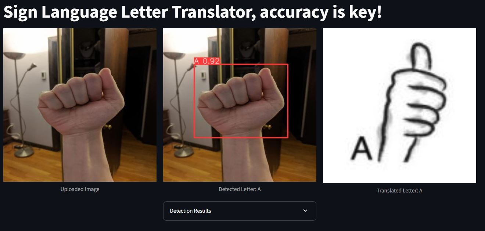

# 🌟 Sign Language Letter Translator 🌟

Welcome to the **Sign Language Letter Translator**! This project uses **YOLOv8**, **Streamlit**, and **Python** to detect and translate sign language letters. Its interactive interface processes images and video feeds to make sign language translation seamless and accessible. The nightmare from my time in college, enjoy!

---

## 📜 Table of Contents
- [✨ Features](#-features)
- [🛠️ Technologies Used](#️-technologies-used)
- [📥 Installation](#-installation)
- [📖 Usage](#-usage)
- [📂 Project Structure](#-project-structure)
- [📊 Results and Performance](#-results-and-performance)
- [🙌 Acknowledgments](#-acknowledgments)
- [📜 License](#-license)
- [🚀 Future Improvements](#-future-improvements)

---

## ✨ Features

### 🔍 Real-Time and Batch Processing
- **Real-time Detection**: Translate sign language using live webcam feeds.
- **Image Upload**: Detect letters in uploaded images.

### 🌍 Multi-Language Support
- Translate between **Irish Sign Language (ISL)**, **British Sign Language (BSL)**, and **American Sign Language (ASL)**.

### 🎛️ Customization and Feedback
- Adjustable model confidence levels for precision control.
- Visual feedback with bounding boxes and translations.

---

## 🛠️ Technologies Used

### Core Technologies
- **Python**: The backbone of the application.
- **YOLOv8**: State-of-the-art object detection for recognizing sign language letters.
- **Streamlit**: Framework for an interactive, browser-based interface.

### Libraries
- **Pillow (PIL)**: Image processing.
- **OpenCV**: Video feed processing.
- **PyYAML**: Configuration management.
- **Streamlit Authenticator**: Secure user authentication.

---

## 📥 Installation

### Prerequisites
- Python 3.8 or higher
- Virtual environment support
- Pre-trained YOLOv8 models

### Steps
1. **Clone the repository**:
   
bash
   git clone https://github.com/johndev94/sign_letter_translator_streamlit.git
   cd sign-language-translator


2. **Set up a Python virtual environment**:
   
bash
   python -m venv env
   source env/bin/activate  # On Windows: .\env\Scripts\activate


3. **Install dependencies**:
   
bash
   pip install -r requirements.txt


4. **Download pre-trained YOLOv8 models** and place them in the models/ folder.

5. **Run the app**:
   
bash
   streamlit run app.py


---

## 📖 Usage

### Step 1: Launch the App
- Start the Streamlit server and access the app via your browser.

### Step 2: Configure the Sidebar
- Select the source type (Image, Video, or Webcam).
- Adjust model confidence.
- Choose input and output languages.

### Step 3: Upload or Stream Content
- Upload an image or video file.
- Use a webcam for live detection.

### Step 4: View Results
- Detected letters, bounding boxes, and translations are displayed on-screen.

---

## 📂 Project Structure

```
project-root/
├── app.py                  # Main application file
├── helper.py               # Helper functions
├── settings.py             # Configuration settings
├── models/                 # Pre-trained YOLOv8 models
├── translated letters/     # Translated images for ISL, BSL, ASL
│   ├── ISL/
│   ├── BSL/
│   └── ASL/
├── requirements.txt        # Python dependencies
└── README.md               # Documentation
```


## 📊 Results and Performance




### Model Accuracy
- **ISL Dataset**: Achieved 99.5% accuracy with no false predictions.
- **BSL Dataset**: mAP@0.5:0.95 reached **91.5%**.
- **ASL Dataset**: Over **90% precision** for most classes.

### Real-Time Performance
- **Inference time**: ~713ms per frame on a standard GPU.

### Evaluation Metrics
- **Precision**: Accuracy of detected letters.
- **Recall**: Completeness of detections.
- **mAP (Mean Average Precision)**: Measures overall model performance.

[Watch the demo video](images/Streamlit_demo-ezgif.com-video-to-gif-converter.gif)


---

## 🙌 Acknowledgments

Special thanks to:
- **YOLOv8 creators** for enabling advanced object detection.
- **Streamlit team** for their powerful interactive framework.
- **My family** for supporting me through college.


---

## 🚀 Future Improvements
- Dynamic sentence-level translations.
- Support for additional sign languages and gestures.
- 3D gesture rendering for enhanced feedback.
- Optimization for real-time performance.

---

Feel free to explore, contribute, and help improve the project!  
🔗 **[GitHub Repository](https://github.com/johndev94/sign_letter_translator_streamlit/tree/main?tab=readme-ov-file#-future-improvements)**
